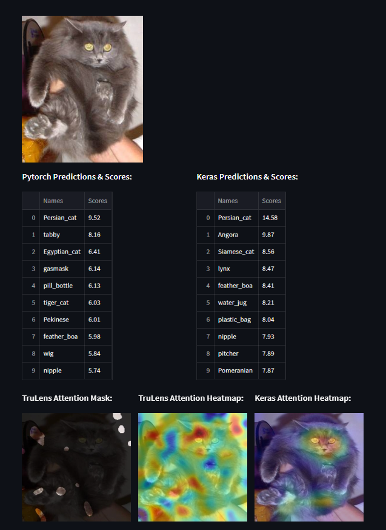

# Streamlit ML Image Classifier App
I developed this application as a demo project for my predictive analytics class as a refresher on how image classification models work. This app was created with a number of Python libraries as well as Streamlit, a data visualization tool for Python.

This application will alow you to see predictions scores made with the same model (VGG16) copied from 2 different libraries (Kera, PyTorch). Additionally, heat maps are generated which show where each model is <i>looking</i> to make its predictions.

</img>

<i>A screenshot of the application in action</i>

### Quickstart Guide
1. Clone this repository
2. Create a venv and install the ```requirements.txt``` into the virtual environment
    - note: there may be quite a few redundant packages in the requirements files. It may also take a minute to finish installing.

3. Once the installation is complete, spin up the virtual environment and run ```streamlit run app.py```
4. The application should run locally on ```http://localhost:8501```

### Project Details

Convolutional Neural Networks (ConvNets or CNNs) have gained massive popularity in recent years, mostly being used to analyze visual imagery. Their applications are wide-ranging, from simple binary classifiers to complex models that are used in hospitals to identify tumors. 

Despite being so widely used, CNNs are still somewhat of a black box: it is not always clear “why” a model makes the prediction that it does. Without this information, how can researchers and developers be sure their models will work in the real world?

One way we can analyze how an image classifier model makes its predictions is by using tools like TruLens and Keras-vis. These analytical tools can help generate attention heatmaps for input images, showing us just where the model is looking when it makes a prediction. 

Additionally, tools like TruLens provides additional insights such as being able to see the most important feature map in each layer, giving us important information for evaluating our models.

For this project, we’ll be importing a pre-trained <b>VGG16 model</b> from pyTorch. Just as a quick introduction, VGG16 is a CNN developed by the Visual Geometry Group from Oxford University. This model won the ImageNet Large Scale Visual Recognition Challenge (ILSVRC) in 2014, and is widely considered one of the best image classifier models to currently exist. It is able to classify over 1000 objects with ~93% accuracy. The 16 in VGG16 stands for 16 weighted layers (13 Convolution layers and 3 Dense layers).
